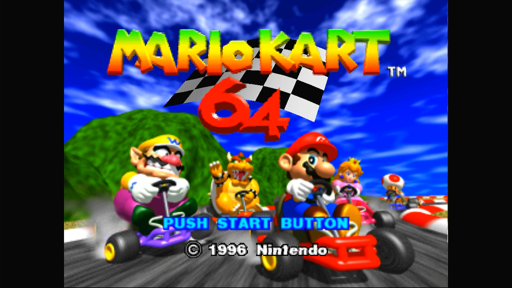
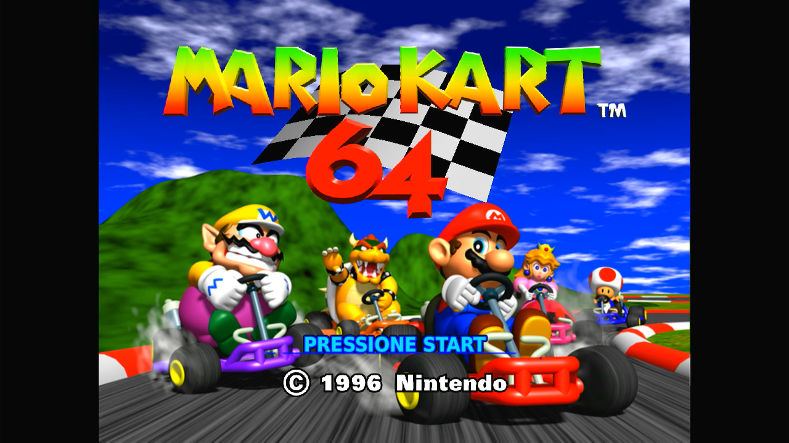
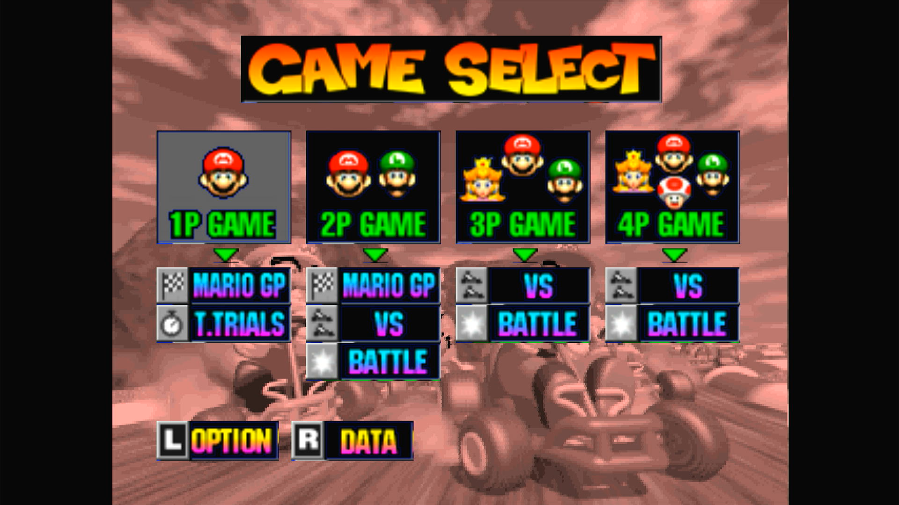
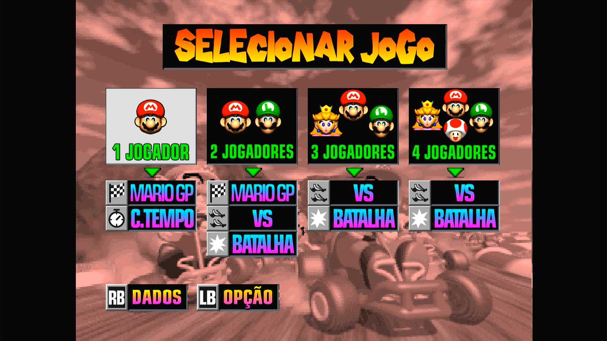
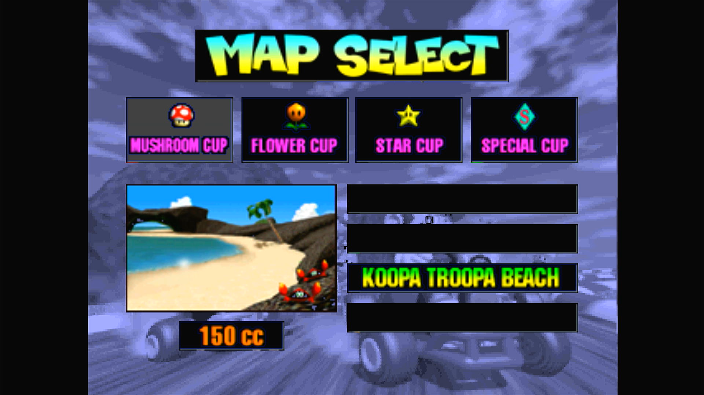
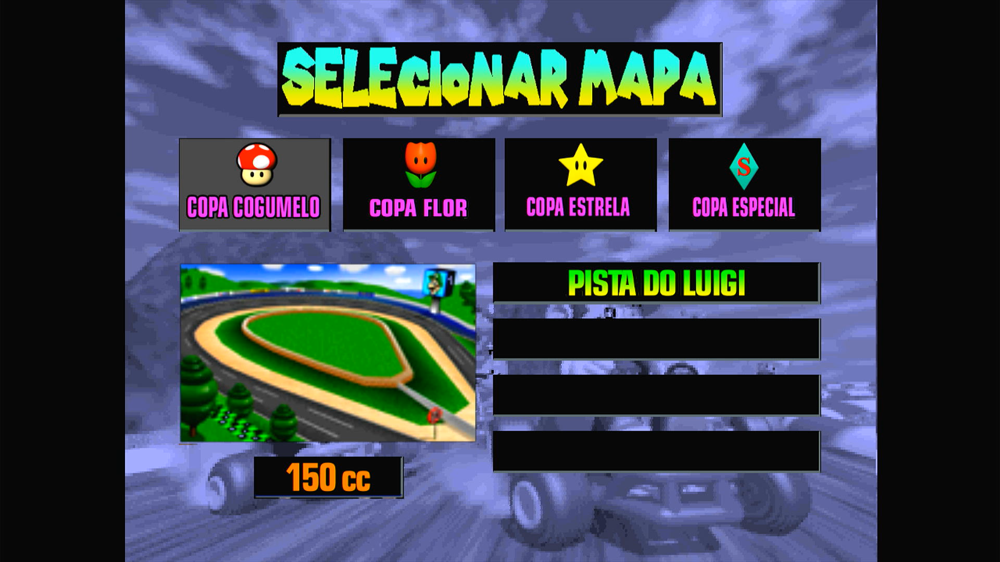
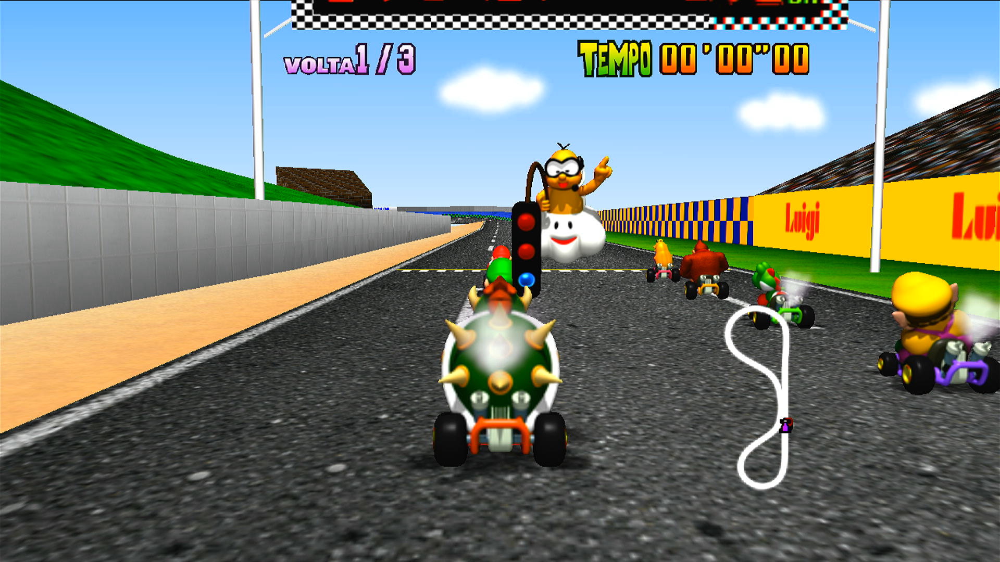

# MKart360 — Fork de Edição de Texturas

Fork do [sirdankz/MKart360](https://github.com/sirdankz/MKart360) (port de
Mario Kart 64 para Xbox 360, baseado na decompilação
[n64decomp/mk64](https://github.com/n64decomp/mk64)). Este fork adiciona um 
**sistema de substituição de texturas HD em tempo de execução**,
sem modificar a ROM nem os assets compilados do jogo, e funciona com
**ROMs de todas as regiões** graças ao meu amigo
**[Eduardo](https://github.com/EduDicaseGameplay)**, do canal do YouTube
**[Edu Dicas e Gameplay](https://www.youtube.com/@EduDicaseGameplay)**

---

## O que mudou em relação ao projeto original

### Código modificado

- **`mk64-master/include/xbox360/gfx_pc.c`**
  Gancho de texturas HD dentro de `import_texture()`: o jogo calcula um hash
  FNV-1a do conteúdo de cada textura original e, se existir uma versão HD com
  esse hash, ela é usada no lugar. Inclui:
  - leitura do `tex.pak` por meio de uma tabela indexada por hash;
  - alternativa com arquivos `.tex` avulsos em subpastas (para contornar o
    limite de arquivos por pasta do FATX);
  - cache em RAM das texturas HD (evita reler do disco);
  - cache de texturas ampliado (de 512 para 1024 entradas);
  - trace de diagnóstico desligado por padrão (`X360_HDTEX_TRACE 0`), com um
    modo de menu (`X360_HDTEX_TRACE_MENU`) que também registra a posição de
    cada pedaço;
  - o gancho HD não sobrescreve mais o hash de conteúdo do cache de
    texturas — isso corrigiu as piscadas nas texturas de menu carregadas em
    blocos;
  - **compressão DXT1/DXT5 opcional** dentro do `tex.pak` (veja
    [tex.pak comprimido](#texpak-comprimido-dxt-opcional)), descomprimida no
    console antes de a textura ser enviada à GPU. Arquivos `tex.pak` antigos,
    sem compressão, continuam sendo lidos normalmente.
  - `x360_try_draw_hd_menu_quad` já existe no código, mas está **inativa**
    (ainda não é chamada) — reservada para uma substituição futura das
    texturas grandes de menu.

- **`mk64-master/.gitignore`**
  Agora ignora as texturas extraídas, o `tex.pak`, os logs de trace e
  `src/xbox360/generated_banks/` (tudo derivado da ROM do próprio usuário, e
  que não deve entrar no controle de versão).

### Limitações conhecidas

- Texturas em resolução muito alta (acima de HQ) podem sobrecarregar o
  hardware do Xbox 360 e causar travamentos ou problemas de desempenho; o
  suporte a HD existe, mas é limitado ao hardware do console.
- Foi descoberto que ao executar o jogo com um tex.pak em discos rígidos mecânicos,
  sejam internos ou externos, pode causar pequenos travamentos durante o jogo, 
  o desempenho pode variar, recomenda-se o uso de pen drives ou SSDs.
- A compressão DXT tem perda: ela reduz muito o tamanho do `tex.pak`, mas pode deixar
  granulação/faixas visíveis e pequenas alterações de cor (veja
  [tex.pak comprimido](#texpak-comprimido-dxt-opcional)).

---

## 🖼️ Prévia

### Fundo antes

<p align="center">
  
</p>

### Fundo depois

<p align="center">
  
</p>

### Seleção de jogo antes

<p align="center">
  
</p>

### Seleção de jogo depois

<p align="center">
  
</p>

### Seleção de personagem antes

<p align="center">
  
</p>

### Seleção de personagem depois

<p align="center">
  
</p>

### Seleção de pistas antes

<p align="center">
  
</p>

### Seleção de pistas depois

<p align="center">
  
</p>

### Jogabilidade antes

<p align="center">
  
</p>

### Jogabilidade depois

<p align="center">
  
</p>

---

## Novas ferramentas

Todos os scripts abaixo precisam ser executados de dentro
da pasta `mk64-master/`, os que foram criados para diagnóstico/debug e testes ficam na pasta `legacy_diagnostic_tools/`
mas para funcionarem, precisam ser movidos para `mk64-master/`, com exceção de `HALVE_PNGS.py` que funciona em qualquer lugar

| Arquivo | Função |
|---|---|
| `EXTRACT_MK64_TEXTURES.py` | Extrai as texturas da ROM em PNGs editáveis |
| `PACK_TEXTURES.py` | Empacota os PNGs editados no formato que o jogo lê (`tex.pak`) |
| `HALVE_PNGS.py` | Reduz a resolução de PNGs HD pela metade, para caber na memória do console, use se tiver problemas de desempenho |
| `SCAN_HALVES.py` | Ferramenta de diagnóstico: descobre onde ficam as "metades de baixo" dos sprites de kart quando o hash não bate |
| `CROSS_CHECK.py` | Cruza o log de trace do jogo com os manifests para achar texturas não encontradas |
| `SCAN_MENU.py` | Mede, a partir de um log de trace, como o jogo divide as imagens grandes de menu em blocos |
| `menu_tiles_geometry.json` | Disposição medida dos blocos das imagens de menu (só coordenadas, nada da ROM) |

Requisito, instalado uma única vez:

```powershell
pip install pillow
```

### Fluxo completo de uso

**1. Extrair as texturas da ROM**

```powershell
py .\EXTRACT_MK64_TEXTURES.py --rom .\baserom.us.z64
```

Gera a pasta `extracted_textures\` com:

- **raiz** — texturas comuns, com nomes no formato `<hash>__nome.png`;
- **`generated\`** — bancos gerados (menus, HUD), com o nome do símbolo;
- **`karts\<personagem>\frames\`** — sprites de piloto+kart (321 por
  personagem);
- **`*_manifest.json`** — metadados que ligam cada PNG ao seu hash. **Não
  apague nem mova esses arquivos.**

Por padrão, o extrator não sobrescreve PNGs já existentes (é seguro rodar de
novo — ele só preenche o que falta). Use `--force` para regerar tudo do zero
(isso descarta suas edições). Outras opções: `--no-karts`, `--no-generated`,
`--out PASTA`.

**2. Editar**

Abra os PNGs e redesenhe/amplie em HD. A resolução pode ser alterada
livremente dentro dos limites de memória do console (por exemplo, 128×128 no lugar de um original de 64×64), geralmente é 
seguro utilizar texturas com o dobro da resolução das originais, e até o triplo, mas o quadruplo pode causar problemas de desempenho. **Não
renomeie os arquivos PNG** — o nome (ou o caminho registrado no manifest) é o que
liga a textura editada à original.

**3. Empacotar**

```powershell
py .\PACK_TEXTURES.py --only karts --pak
```

Gera `tex\tex.pak`, um único arquivo com tudo dentro.

| Opção | Efeito |
|---|---|
| `--pak` | Gera um arquivo único (**recomendado**) |
| `--only PREFIXO` | Limita a um subconjunto, ex.: `--only karts\bowser` |
| `--out PASTA` | Pasta de saída (padrão `tex`) |
| `--max N` | Ignora imagens maiores que N pixels (padrão 2048) |
| `--dxt` | Com `--pak`: grava as texturas comprimidas em DXT1/DXT5 (veja abaixo) |

Sem `--pak`, são gerados milhares de arquivos `.tex` avulsos — funciona, mas
carrega mais devagar e é mais frágil de transferir; use só para depuração.
Empacote apenas o que você realmente editou: PNGs não editados geram texturas
idênticas às originais, sem ganho visual, mas ocupando espaço e memória.

**4. Instalar no console**

Copie o `tex.pak` para a raiz da pasta do jogo, ao lado do executável:

```
MK64.xex
baserom.us.z64
tex.pak          <- aqui, NÃO dentro de uma pasta tex\
```

Trocar texturas não exige recompilar o executavel .xex — o `tex.pak` é lido em tempo de
execução. Só é preciso recompilar quando o código C muda.

### tex.pak comprimido (DXT, opcional e experimental)

```powershell
pip install numpy
py .\PACK_TEXTURES.py --pak --dxt
```

Cada textura é gravada como **DXT1** (opaca ou com transparência
"liga/desliga", ~8× menor que RGBA) ou **DXT5** (transparência gradual, ~4×
menor). O console lê menos do disco e cabem mais texturas no cache em RAM;
os dados são descomprimidos pela CPU antes do envio à GPU.

Limitações:

- **Tem perda.** Degradês podem apresentar granulação ou faixas, e os sprites
  podem ter pequenas alterações de cor (por exemplo, bordas mais claras).
  Compare com e sem `--dxt` e fique com o que parecer melhor para você.
- **Não elimina as travadinhas de carregamento.** Os testes mostraram que as
  travadas da primeira vez nos menus e nas pistas com muitas texturas vêm da
  *quantidade* de leituras do disco, e não do tamanho delas — o DXT deixa
  cada leitura menor, mas não reduz o número de leituras.
- **A memória de vídeo não muda:** as texturas continuam chegando à GPU em
  RGBA, então o uso de memória de vídeo é o mesmo que sem compressão.
- Texturas cuja largura ou altura não seja múltipla de 4, e a textura do
  botão "OK" do menu, são sempre gravadas sem compressão.
- Um `tex.pak` comprimido **exige o `gfx_pc.c` atualizado**; versões antigas
  não conseguem lê-lo. A versão atualizada lê tanto paks comprimidos quanto
  sem compressão.

### Limites de memória

O Xbox 360 tem 512 MB compartilhados entre sistema e vídeo. O elenco completo
de personagens/karts soma 2568 sprites (2 arquivos cada):

| Resolução | Total estimado | Observação |
|---|---|---|
| 256×256 | ~640 MB | não cabe |
| 128×128 | ~160 MB | recomendado |
| 96×96 | ~90 MB | mais folga |

Para reduzir PNGs já editados:

```powershell
py .\HALVE_PNGS.py --recursive              # prévia, não altera nada
py .\HALVE_PNGS.py --apply --recursive      # aplica de fato
```

Use `--backup` para manter os originais como `*.orig.png`.

### Diagnóstico (quando uma textura não aparece em HD)

Em `include\xbox360\gfx_pc.c`, troque:

```c
#define X360_HDTEX_TRACE 0   →   1
```

Recompile, jogue alguns segundos e pegue o `game:\hdtex-trace.log`. Cada
linha mostra o hash calculado em tempo de execução e `found=1` ou `found=0`.
Para cruzar esse log com os manifests:

```powershell
py .\CROSS_CHECK.py --log .\hdtex-trace.log --kart bowser
```

Se a textura que falta for a "metade de baixo" de um sprite de kart que nunca
casa (`found=0` mesmo existindo no manifest), rode:

```powershell
py .\SCAN_HALVES.py --rom .\baserom.us.z64 --log .\hdtex-trace.log --kart bowser
```

Ele varre o bloco descomprimido da ROM procurando qual janela de 2048 bytes
gera o hash que falta, revelando o deslocamento real da metade — útil para
corrigir o extrator.

Deixe o trace desligado no uso normal: ele grava no disco durante o jogo e
afeta o desempenho.

### Texturas de menu

As imagens grandes de menu (por exemplo, os retratos da seleção de
personagem) passam do limite de 4 KB da TMEM, então o jogo as carrega em
blocos (33×33, com 1 texel de sobreposição), cada um com hash próprio. O
`menu_tiles_geometry.json` guarda a disposição medida dos blocos; o
`PACK_TEXTURES.py` calcula o hash de cada bloco a partir dos dados da **sua**
ROM e recorta a arte HD do mesmo jeito. Não há nada a fazer: é só editar o
PNG em `extracted_textures\generated\course_player_selection\` e empacotar.

Para incluir uma tela ainda não medida: em `gfx_pc.c`, troque
`X360_HDTEX_TRACE` para `1`, recompile com `/t:Rebuild`, fique alguns
segundos na tela, copie o `hdtex-trace.log` para `mk64-master\` e rode:

```powershell
py .\SCAN_MENU.py --log .\hdtex-trace.log --only generated/course_player_selection
```

Ele acrescenta as imagens novas ao `menu_tiles_geometry.json`. Depois, volte
o trace para `0`.

### Problemas comuns

- **As texturas não aparecem** → confira se o `tex.pak` está na raiz, ao
  lado do `MK64.xex` (e não dentro de `tex\`). Se estiver certo, force uma
  recompilação completa (`/t:Rebuild`) — o `gfx_pc.c` é incluído por outro
  arquivo, e a compilação incremental às vezes não percebe a mudança.
- **Só metade do sprite fica em HD** → os sprites CI8 são carregados em duas
  janelas por causa do limite de 4 KB da TMEM, cada uma com hash próprio. O
  extrator já trata isso; se acontecer, regere os manifests com o extrator
  atualizado e empacote de novo.
- **A transferência para o console falha no fim** → o sistema de arquivos
  do Xbox 360 (FATX) aceita no máximo 4096 arquivos por pasta. É exatamente
  isso que a opção `--pak` resolve, gerando um arquivo único.
- **Travadinhas durante o jogo** → reduza a resolução (128×128) ou a
  quantidade de personagens substituídos. Uma pequena travada quando um
  adversário novo aparece na tela é esperada: os sprites dele são carregados
  naquele momento.

### Como funciona por dentro

1. O jogo carrega uma textura e calcula um hash FNV-1a do conteúdo original.
2. O `gfx_pc.c` procura esse hash no `tex.pak`.
3. Se encontrar, a versão HD é enviada à GPU no lugar da original.
4. Se não encontrar, segue o caminho normal — nada quebra.

As dimensões originais são preservadas internamente para o mapeamento de
coordenadas, então a textura HD pode ter qualquer resolução. Os dados
carregados ficam em cache na RAM para evitar releituras do disco.

---

## Como compilar o projeto

### Requisitos

- Windows
- Python 3
- SDK do Xbox 360 / ferramentas de compilação Xbox 360 do Visual Studio
- Sua própria ROM americana (US) de Mario Kart 64
- Um Xbox 360 capaz de rodar arquivos XEX homebrew

### 1. Preparar os assets

Coloque sua ROM em:

```
mk64-master\baserom.us.z64
```

Depois, dentro de `mk64-master`:

```powershell
powershell -ExecutionPolicy Bypass -File ".\xbox360\setup_windows_asset_tools.ps1" -SkipTorch
```
Espere as Ferramentas necessárias baixarem, em seguida:

```powershell
py ".\PUBLIC_PREPARE_MK64_ASSETS.py"
```

O script verifica a ROM e gera os arquivos derivados dela, que ficam
propositalmente de fora da publicação do código-fonte.

### 2. Compilar

Na pasta que contém o `MK64.sln`, rode:

```powershell
& "$env:WINDIR\Microsoft.NET\Framework\v4.0.30319\MSBuild.exe" ".\MK64.sln" /t:Build "/p:Configuration=Release" "/p:Platform=Xbox 360"
```

Ou, de forma mais simples:

```powershell
powershell -ExecutionPolicy Bypass -File ".\PUBLIC_BUILD_XBOX360.ps1"
```

O `.xex` compilado fica na pasta de saída Release do projeto Xbox 360.

### 3. Aplicar as texturas HD (opcional)

Depois de compilar, gere e copie o `tex.pak` como descrito na seção
["Novas ferramentas"](#novas-ferramentas) acima. Trocar texturas depois disso
não exige recompilar.

> Se algo não fizer efeito depois de editar o `gfx_pc.c`, force
> `/t:Rebuild` — a compilação incremental às vezes não detecta mudanças nesse
> arquivo.

---

## Créditos

- **[n64decomp/mk64](https://github.com/n64decomp/mk64)** — a decompilação
  original de Mario Kart 64, a base de todo o projeto.
- **[sirdankz/MKart360](https://github.com/sirdankz/MKart360)** — o port para
  Xbox 360 (compilação nativa, multiplayer entre consoles, correções de
  renderização), do qual este repositório é um fork.
- **[Edu dicas e gameplay](https://github.com/EduDicaseGameplay)** — quem
  conseguiu decifrar o sistema de extração das texturas "TKMK00", tornando
  possível substituir os quadros e texturas do menu principal, além de ter
  aprimorado o sistema de extração a um ponto que eu não tinha conseguido
  alcançar.

Mario Kart 64 e as propriedades relacionadas pertencem à Nintendo. Este é um
port homebrew não oficial, sem vínculo com a Nintendo e sem o seu apoio.
